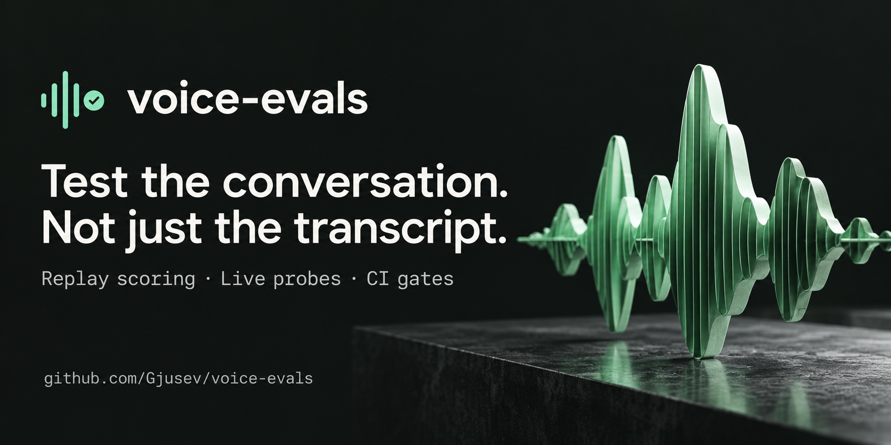

<p align="center">
  
</p>

# voice-evals

**Reproducible evaluation for voice agents.** Score recorded calls, run scripted conversations over WebSocket, and turn transcription, latency, interruptions and task outcomes into CI gates.

[](https://pypi.org/project/voice-evals/)
[](https://pypi.org/project/voice-evals/)
[](https://github.com/Gjusev/voice-evals/actions/workflows/test.yml)
[](LICENSE)

[Watch the demo](#watch-the-demo) · [Quick start](#quick-start) · [Kaggle notebooks](#reproduce-in-kaggle) · [Live probe](#live-probe) · [Documentation](#documentation)

A voice agent can produce the right words and still respond too slowly, talk over a caller, or miss a correction. `voice-evals` makes those failures inspectable: a scripted caller talks to your agent, interrupts it, records the session, and exports a dataset that the offline evaluator can score again.

**Why it exists.** I'm building a voice agent as a hobby project and wanted exactly this combination: deterministic scoring (jiwer WER, exact outcome matching, no LLM judge), per-stage latency budgets, barge-in stop-time measurement, CI gates, and a probe that talks to any WebSocket agent through a declarative protocol map instead of one framework's transport. Open-source voice evals exist, Pipecat ships evals for its own transport and ServiceNow's EVA is an enterprise benchmark suite, but none matched that trade-off. voice-evals is the harness that project needed.

**Start without API keys.** Replay evaluation and the mock probe run offline. Real calls need your agent's endpoint and a caller TTS provider.

## Watch the demo


The demo loops automatically without sound. The scores in it come from synthetic calls. [Transcript](docs/demo-transcript.md) · [Download MP4 with sound](docs/assets/voice-evals-demo.mp4) · [Media credits](docs/assets/README.md#video-credits).

<details>
<summary>Play the full-quality video with sound</summary>

https://github.com/user-attachments/assets/3b67eb82-26ce-4247-b652-b0f5b7513b20

Press play and enable sound for the music.

</details>

## Choose your starting point

| You have… | Start here | What you get |
| --- | --- | --- |
| Recorded transcripts and timings | `voice-eval run calls.jsonl` | Metrics, per-call details and configurable gates |
| A live WebSocket voice agent | `voice-eval probe scenario.json` | A scripted call, interruption observations and replayable artifacts |
| No agent or credentials yet | [Offline quick start](#quick-start) or [Kaggle](#reproduce-in-kaggle) | A complete offline run you can reproduce yourself |

## Quick start

Python **3.10+**. Clone the repository to get the example datasets, then install the package:

```bash
git clone https://github.com/Gjusev/voice-evals.git
cd voice-evals
python -m pip install voice-evals
voice-eval run evals/data/demo_calls.jsonl
```

If you already have a dataset, installing from PyPI is enough: `voice-eval run calls.jsonl`.

<details>
<summary>See the three-call demo output</summary>

```text
samples=3 failures=0
wer mean=0.0303 max=0.0909
task_completion=0.6667
fact_coverage=0.8333
hallucination_rate=0.3333
e2e_ms p50=950.0 p95=1103.0 p99=1116.6
stage means: e2e_ms=963.3 llm_ttft_ms=330.0 stt_ms=200.0 tts_ttfa_ms=236.7
interruptions=1 median_barge_in_stop_ms=210.0
gate: PASSED
```

These are synthetic example calls, not provider benchmarks. With no thresholds configured, a passing gate does not imply production readiness. `failures=0` is not a count of successful tasks; task completion is reported separately.

</details>

### Make quality a CI gate

```bash
voice-eval run calls.jsonl --max-wer 0.05 --min-task-completion 0.90 --max-e2e-p95-ms 1000 --json --output result.json
```

Pick thresholds that fit your use case. Replay exits with **0** when the gates pass, **1** when one fails, and **2** on a dataset error. See the repository's [CI workflow](.github/workflows/test.yml) for executable examples.

## Reproduce in Kaggle

| Notebook / kernel | What it exercises | Links |
| --- | --- | --- |
| **Offline benchmark** | Pinned wheel bundle, three-call demo, 123-call regression corpus, mock and fixture probes | [Open on Kaggle](https://www.kaggle.com/code/gjusev/voice-evals-offline-benchmark) · [Source](kaggle-kernel/offline/script.py) |
| **Live probe** | Scripted WSS session with your credentials; a clearly labeled mock run when secrets are absent | [Open on Kaggle](https://www.kaggle.com/code/gjusev/voice-evals-live-probe) · [Source](kaggle-kernel/probe/script.py) |

Both notebooks are published and verified. The offline kernel passed its full check suite with internet disabled on 2026-10-04, and the live kernel completed its no-secrets mock path. If a notebook is unavailable to you, its local source and the [Kaggle reproduction guide](docs/kaggle.md) describe the same steps. The [offline bundle](https://www.kaggle.com/datasets/gjusev/voice-evals-v020-offline-bundle) supplies pinned wheels and checksums.

The offline kernel runs with internet disabled. The live kernel needs an externally reachable WSS endpoint for a live call; localhost on your machine is not reachable from Kaggle. Its latency numbers include the Kaggle datacenter's network path, and its mock timings are simulated.

## What it measures

| Layer | Measurement | Interpretation |
| --- | --- | --- |
| **Transcription** | Per-call WER, mean and maximum | Compares ASR text with a supplied reference; mean WER weights calls equally |
| **Latency** | E2E p50/p95/p99; available STT, LLM TTFT and TTS TTFA means | Stage timings require explicit observations; missing stages are not inferred |
| **Interruptions** | Barge-in observations and measured stop time | A stop that is never confirmed is reported as censored |
| **Task outcome** | Completion, required-fact coverage, forbidden-phrase rate | Deterministic checks against your scenario, not an LLM judge |

The output field `hallucination_rate` measures calls containing a configured forbidden phrase. It does not detect every possible hallucination. [Read the metric definitions](docs/data-format.md#metric-semantics).

## How it works


[View full-size diagram](docs/assets/evaluation-flow.svg) · [Mermaid source](docs/assets/evaluation-flow.mmd)

**One evaluator, two entry points.** A scored probe exports the same replay format used for offline calls. Replay reproduces the legacy scores from that recording; a new live call can vary with the agent, provider and network.

## Live probe

From the cloned repository, try the four-turn appointment scenario with a conditional branch and deliberate interruption:

```bash
python -m pip install "voice-evals[probe]"
voice-eval probe src/voice_evals/resources/scenarios/appointment-v2.json --mock --output-dir out/probe-demo --max-wer 0.05 --max-barge-in-stop-ms 500
voice-eval run out/probe-demo/calls.jsonl
```

The mock demo takes about 25 seconds and needs no credentials or network. Its timing is simulated.

For a real call, configure `ELEVENLABS_API_KEY`, `ELEVENLABS_VOICE_ID` and `PROBE_TRANSPORT_URL`, plus `PROBE_AGENT_API_KEY` if your endpoint requires authentication:

```bash
voice-eval probe src/voice_evals/resources/scenarios/appointment-v2.json --caller elevenlabs --output-dir out/probe-live --json
```

Your endpoint must match a [protocol map](src/voice_evals/resources/protocols/default-v1.json). The current transport supports mono s16le PCM at 16/24 kHz; arbitrary telephony or binary protocols need an adapter. Start with the [local reference agent](examples/reference-agent/README.md) to exercise real sockets.

### Caller and integration options

<p>
  <a href="https://www.python.org/"></a>&nbsp;&nbsp;
  <a href="https://www.kaggle.com/code/gjusev/voice-evals-offline-benchmark"></a>&nbsp;&nbsp;
  <a href="https://pypi.org/project/voice-evals/"></a>&nbsp;&nbsp;
  <a href="https://elevenlabs.io/"></a>&nbsp;&nbsp;
  <a href="https://github.com/Gjusev/voice-evals"></a>
</p>

| Caller | Use it for | Setup |
| --- | --- | --- |
| Mock | Offline harness checks | `--mock` |
| Audio fixtures | Prepared caller recordings | `--caller fixture --fixture-manifest …` |
| ElevenLabs | Hosted caller TTS | `--caller elevenlabs` and provider credentials |
| HTTP TTS | An externally hosted speech model | `--caller http`, `CALLER_TTS_URL` and a compatible service |

[Open-model examples](examples/open-models/README.md) include Qwen3-TTS, Kokoro and Chatterbox caller profiles, plus a Voxtral STT gateway example. Model services run separately. Logos identify technologies and integrations, not endorsements.

### Inspect the evidence

```text
out/probe-demo/
  manifest.json       sanitized config, provenance and file hashes
  events.jsonl        normalized event journal
  calls.jsonl         replay dataset for eligible sessions
  result.json         scores, probe observations and gate result
  audio/caller/       sent audio, per utterance
  audio/agent/        received audio, per response
```

Ineligible sessions report **NOT SCORED** with reasons. Manifests record credential environment-variable names, not secret values. Missing stage observations stay unavailable; a timed-out interruption is never assigned an invented stop duration.

**Recorded live validation:** one ElevenLabs TTS → real WSS → reference-agent Scribe STT session completed with WER **0.1379** and barge-in stop **232.6 ms**. It **failed** its WER gate of 0.10. The reference dialogue policy was scripted, and this single run is transport evidence rather than a model ranking. [Method, latency aggregation and reproduction tests](docs/live-probe.md#recorded-live-validation-2026-10-04).

## Documentation

| Resource | Contents |
| --- | --- |
| [Live probe guide](docs/live-probe.md) | Real calls, scenario branches, transport maps, artifacts and scoring eligibility |
| [Dataset format and Python API](docs/data-format.md) | JSONL schema, metric definitions and programmatic examples |
| [Kaggle reproduction](docs/kaggle.md) | Secrets, offline bundles, runtime behavior and publishing commands |
| [Regression corpus](evals/data/README.md) | 123 frozen calls, hand-checked WER cases and dataset limits |
| [Reference agent](examples/reference-agent/README.md) | Local WebSocket endpoint with scripted policy and STT modes |
| [Open-model examples](examples/open-models/README.md) | HTTP caller services, model profiles and Voxtral gateway |

## Development

```bash
uv sync --extra probe
uv run pytest -q -m "not live"
uv run ruff check src tests scripts kaggle-kernel examples
uv build
```

The [Makefile](Makefile) also provides `make demo-probe`, `make test-integration` and `make kaggle-bundle`. Offline tests never call real services. Live integration tests require `VOICE_EVALS_LIVE_TESTS=1` and relevant credentials, and are blocked under CI.

Found an integration gap? [Open an issue](https://github.com/Gjusev/voice-evals/issues) with the protocol, a minimal sanitized example, and the expected behavior.

## Roadmap

- Twilio/Telnyx media-stream adapters.
- A dedicated OpenAI Realtime adapter.
- An optional LLM judge for graded outcomes.
- A GitHub Action for comparison against a committed baseline.

These are planned capabilities, not current integrations.

## License

[Apache 2.0](LICENSE). Built by [Gjusev](https://github.com/Gjusev).
